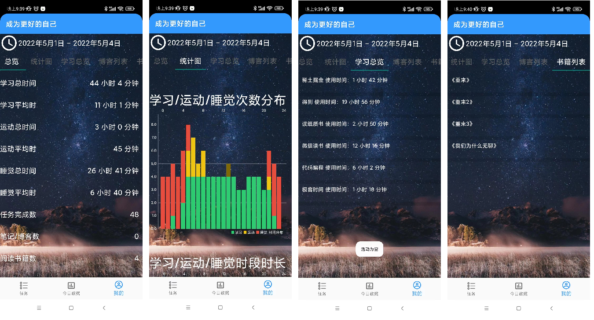

# Self Growth Android 
***

**自我生长：成为更好的自己**

**自我生成手机应用使用情况统计Android客户端**

**不是搞Android开发的，第一次写Android应用，可能有点不规范，请包涵**

**当前只适配了红米11，小米6可以，其他机型可能会有问题**

**感兴趣，可以一起完善**

## 简介
自律性辅助软件，成为更好的自己

定时的检测收集当前手机的顶层应用，将其记录到本地存储中，用于统计和展示手机APP的使用情况

有简单的任务清单功能，提供辅助的任务规划安排

## 功能简介
客户端主要功能定位是：

- [x] 收集手机当前应用使用情况
- [x] 任务列表
- [x] 今日当前截止手机应用使用情况
- [x] 统计展示一定时间周期内的APP和任务数据

数据均是存储在本地，在无网络的情况下，完全可以正常使用所有功能

任务相关的模块在登录后，可以和Web进行同步使用,数据在登录的情况下，可选择同步到服务器，用于数据丢失恢复和跨手机设备同步(有空下个版本开发中)

本应用处于后台运行即可，运行期间监听手机切换应用事件，定时记录最顶部应用数据

## 下载链接

- github下载地址：[self-growth.apk](https://github.com/lw1243925457/self_growth_android/releases/download/V1.0.0/self-growth.apk)
- gitee下载地址：[self-growth.apk](https://gitee.com/free-love/self_growth_android/attach_files/1019329/download/self-growth.apk)

## 详细功能与使用说明
目前为 V1.0.0 本地单机版本，无网络状态下依旧能够运行

主要有两大块功能：

- 1 手机应用使用情况收集与统计
- 2 任务清单

### 1 手机应用使用情况收集与统计
安装完成后，首先需要去应用设置页面设置应用的分类

目前作者认为人生的三大基础是：

- 学习：修仙没有挂，就需要耐得住，学习如练气
- 运动：那个主角不是物法双休？运动如炼体
- 睡觉：没成仙之前，还是好好睡觉吧，熬夜断吾辈成仙路！

通过对手机上的应用设置不同的标签（学习、运动、睡觉、其他），后面便可以收集相关的数据进行统计

#### 初始化设置
如下图，进入我的页面，进行手机初始化应用设置：

#### 今日情况实时统计
在切换应用进行使用时，检测到应用切换事件，定时间隔保存当前应用到本地

注：不统计后台应用，只统计前台应用，即唯一的处于顶层活动的应用

如下图：

左图是对今日学习、运动、睡觉情况的总览，学习情况中列出具体学习的时间

点击类型可以需要其他类型，右图就可以看看今天花费在其他应用上的时间

#### 历史数据统计回顾
每日的数据收集后，能够进行周期性的统计，目前提供：

- 每日统计
- 每周统计
- 每月统计
- 每年统计

每日统计会展示当前的学习、运动、睡觉总时长，还有当前完成的任务总数，还有当天的时间线事件展示（目前只展示学习、睡觉、运动、任务相关的）

每周/月/年统计就是展示周期内的数据了，包括总时间长、平均时长，学习、运动、睡觉常用时间点柱状图解（稍微有点不完善）

如下图，左图是每日统计，右图是每周统计，点击日期可以进行切换选择

### 2 任务清单
任务这块就是一个简单的任务清单功能，提供一个简单的分组

## 工程运行说明
本工程开发基于下面的版本：

- Android SDK 11
- Java 8

## 工程源代码仓库
目前在github和gitee上都有

- github：[https://github.com/lw1243925457/self_growth_android](https://github.com/lw1243925457/self_growth_android)
- gitee:[https://gitee.com/free-love/self_growth_android](https://gitee.com/free-love/self_growth_android)

## 相关的工程与软件
因为本软件是基于检测手机软件进行相关的数据统计的，某些活动可能没有合适的APP，所以写了一些纯展示的APP，用于配合该APP使用

* 读纸质书
  * github: [readbook app download](https://github.com/lw1243925457/ReadBookEmptyApp/releases/download/V0/readbook.apk)
  * gitee: [readbook app download](https://gitee.com/free-love/ReadBookEmptyApp/attach_files/1017157/download/ReadBook.apk)
  
* 代码编程
  * github: [coding app download](https://github.com/lw1243925457/CodeEmptyApp/releases/download/V0/coding.apk)
  * gitee: [coding app download](https://gitee.com/free-love/CodeEmptyApp/attach_files/1017159/download/coding.apk)

## 手机应用情况本地存储统计策略
### 活动
频率：每十秒记录一次当前的顶层手机应用Activity

当前使用SharedPreferences进行数据的存储

目前对于每天的时间约定稍微有些不同，如下：

获取当前时间日期，到天，如 2021_02_21,注意，22点后按照第二天算，也就是不是0点到第二天，而是10点到第二天，恩，早点睡觉比较好

### 任务

## 参考链接
### 资源
- [Awesome Android](https://github.com/JStumpp/awesome-android)
- [Android DOCUMENTATION](https://developer.android.com/reference)
- [字节开源的，Apache2 使用起来放心点：IconPark](https://github.com/bytedance/iconpark)
- [iconparkBETA](https://iconpark.oceanengine.com/official)
- [有哪些无版权、免费、高清图片素材网站？](https://www.zhihu.com/question/318961106/answer/767074512)
- [官方Vector资源:res文件夹右键也可以添加资源](https://fonts.google.com/icons?selected=Material+Icons)
- [pexels 图片资源丰富](https://www.pexels.com/zh-cn/search/%E6%89%8B%E6%9C%BA%E5%A3%81%E7%BA%B8/)
- [UI 开源组件库](https://github.com/Trinea/android-open-project)
- [最流行的android组件大全](https://colobu.com/2014/08/15/android-components-collection/)
- [Android 开源项目分类汇总](https://github.com/Trinea/android-open-project) 
- [二维码生成](https://cli.im/url/info?464597fcec755357a351a16a0e45176c)

### 自动登录
- [Android学习之保存用户登录信息](https://blog.csdn.net/u013132758/article/details/)
- [Fragment生命周期与Fragment执行hide、show后的生命周期探讨](https://blog.csdn.net/s13383754499/article/details/84782605)

### 控件
- [Android列表组件ListView使用详解之动态加载或修改列表数据](https://cloud.tencent.com/developer/article/1742232)
- [Android几种方式实现控件圆角](https://www.jianshu.com/p/ab42f2198776)
- [Best practice to implement key-value pair in android Spinner](https://stackoverflow.com/questions/35449800/best-practice-to-implement-key-value-pair-in-android-spinner)
- [Nice Spinner](https://github.com/arcadefire/nice-spinner)
- [关于Android中Button的Backgroud背景设置默认为蓝紫色，且无法修改的问题](https://my.oschina.net/u/4296470/blog/4732012)
- 输入文本框自动补全
  - ["ArrayAdapter requires the resource ID to be a TextView" XML problems](https://stackoverflow.com/questions/9280965/arrayadapter-requires-the-resource-id-to-be-a-textview-xml-problems)
  - [实例讲解Android中的AutoCompleteTextView自动补全组件](https://m.xp.cn/b.php/54409.html)
- [Android自定义View之PopupLayout（通用弹出式布局）](https://blog.csdn.net/CodingEnding/article/details/81489947)
- [安卓layout布局三等分](https://blog.csdn.net/LY_Dengle/article/details/70172918)
- [Android 退出确认弹窗(AlertDialog)](https://blog.csdn.net/qq_35988274/article/details/100513452)
- [对话框](https://developer.android.com/guide/topics/ui/dialogs)
- [图表库：MPAndroidChart](https://github.com/PhilJay/MPAndroidChart)
- [Android输入法弹出时界面被挤压的问题](https://blog.csdn.net/Sunxiaolin2016/article/details/111947770)
- [表格组件](https://github.com/xiaoowuu/TableView)
- [Android EditText设置边框](https://blog.csdn.net/tracydragonlxy/article/details/100558915)
- [安卓 textview 超出限制自动添加省略号](https://blog.csdn.net/leehu1987/article/details/17247985)
- [Android----复制到剪切板](https://www.jianshu.com/p/1e84d33154bd)
- [200821-Android webview内嵌h5基础使用说明](https://liuyueyi.github.io/hexblog/2020/08/21/200821-Android-webview%E5%86%85%E5%B5%8Ch5%E5%9F%BA%E7%A1%80%E4%BD%BF%E7%94%A8%E8%AF%B4%E6%98%8E/)

### 路由与跳转
- [How to move from one fragment to another fragment on click of an ImageView in Android?](https://stackoverflow.com/questions/23212162/how-to-move-from-one-fragment-to-another-fragment-on-click-of-an-imageview-in-an)
- [Fragment transactions](https://developer.android.com/guide/fragments/transactions)
- [Is there a way to check for popBackStack call in a fragment](https://stackoverflow.com/questions/52645932/is-there-a-way-to-check-for-popbackstack-call-in-a-fragment)
- [Programmatically go back to the previous fragment in the backstack](https://stackoverflow.com/questions/10863572/programmatically-go-back-to-the-previous-fragment-in-the-backstack)

### 数据存储与操作
- [保存键值对数据](https://developer.android.com/training/data-storage/shared-preferences?hl=zh-cn)
- [Android 数据存储（一）——SharedPreferences](https://www.cnblogs.com/PengLee/p/4147530.html)

### 网络
- [Add Header Parameter in Retrofit](https://stackoverflow.com/questions/42898920/add-header-parameter-in-retrofit)
- [Retotfit2默认带请求头](https://blog.csdn.net/yechaoa/article/details/103067284)
- [Retrofit 2 with only form-data](https://stackoverflow.com/questions/37814857/retrofit-2-with-only-form-data)
- [A type-safe HTTP client for Android and Java](https://square.github.io/retrofit/)
- [http请求配置](https://blog.csdn.net/qq_15204179/article/details/98663289)
- [Okhttp3 Https请求配置自签名证书](https://www.jianshu.com/p/4f738788be67)
- [Android okhttp3.0配置https的自签证书和信任所有证书](https://juejin.cn/post/6844903793096687630)
- [看完这篇文章后还不会windows下生成自签名https安全证书的话，你就打死我表弟](https://juejin.cn/post/6844904176284090381)

### 系统
- [Android权限之通知、自启动跳转](https://github.com/LoganZy/AndroidTotal/blob/master/Android%E6%9D%83%E9%99%90%E4%B9%8B%E9%80%9A%E7%9F%A5%E3%80%81%E8%87%AA%E5%90%AF%E5%8A%A8%E8%B7%B3%E8%BD%AC.md)
- [Showing a Snackbar from inside a Service](https://stackoverflow.com/questions/34863038/showing-a-snackbar-from-inside-a-service)
- [Android获得栈中最顶层的Activity](https://www.cnblogs.com/hello-studio/p/9640504.html)
- [Android获取前台进程的方法](https://www.cnblogs.com/fuyaozhishang/p/7442820.html)
- [Android后台执行定时任务](https://blog.csdn.net/qwer492915298/article/details/88533046)
- [Android后台执行定时任务](https://blog.csdn.net/weixin_40420578/article/details/103876900)
- [玩转Android10源码开发定制(十)增加获取当前运行最顶层的Activity命令 ](https://bbs.pediy.com/thread-264950.htm)
- [权限获取](https://programmer.help/blogs/5eb81619d9799.html)

### 其他
- [Android 泛型](https://www.jianshu.com/p/8d7b353ca94b)
- [Android 使用记录访问权限](https://blog.csdn.net/qq_24531461/article/details/67635016)
- [解决 Caused by: org.codehaus.groovy.control.MultipleCompilationErrorsException: startup failed:](https://www.jianshu.com/p/cd75a805ad60)